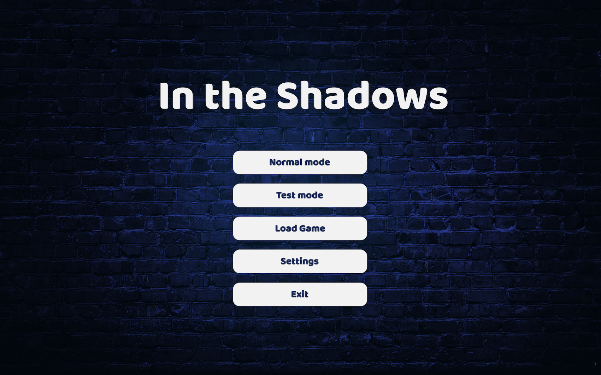
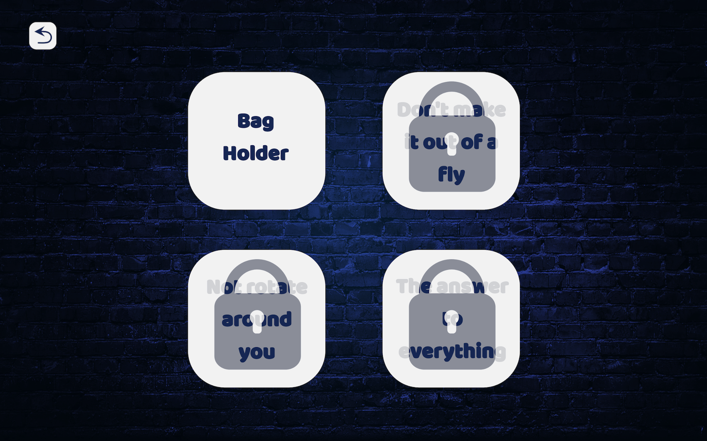
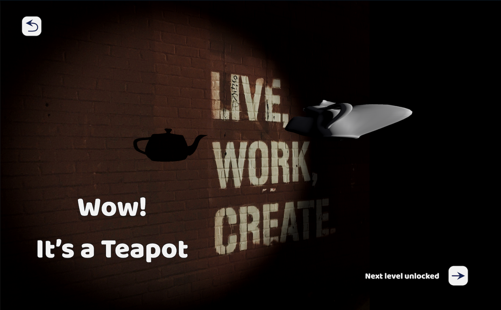
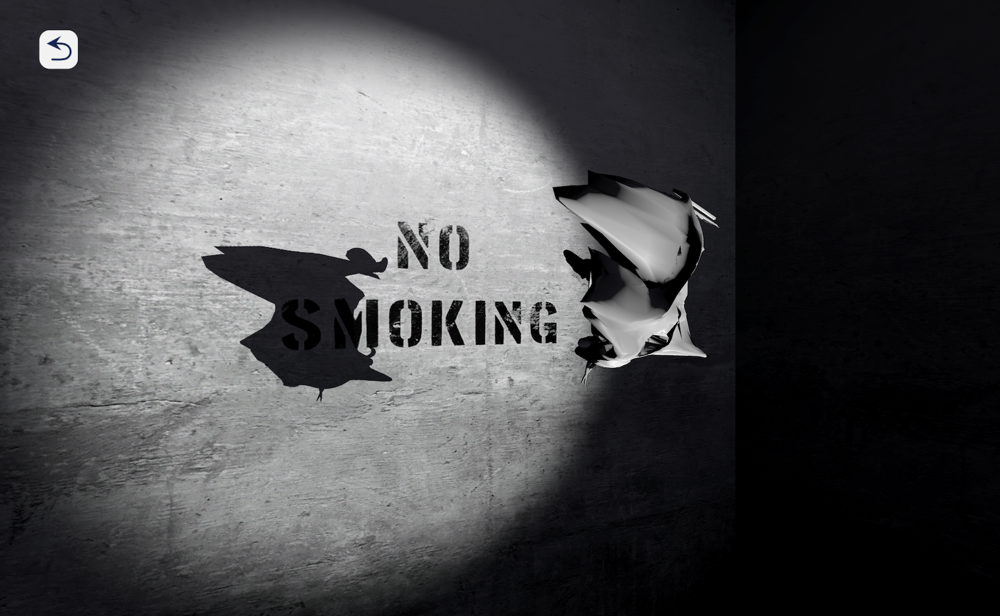
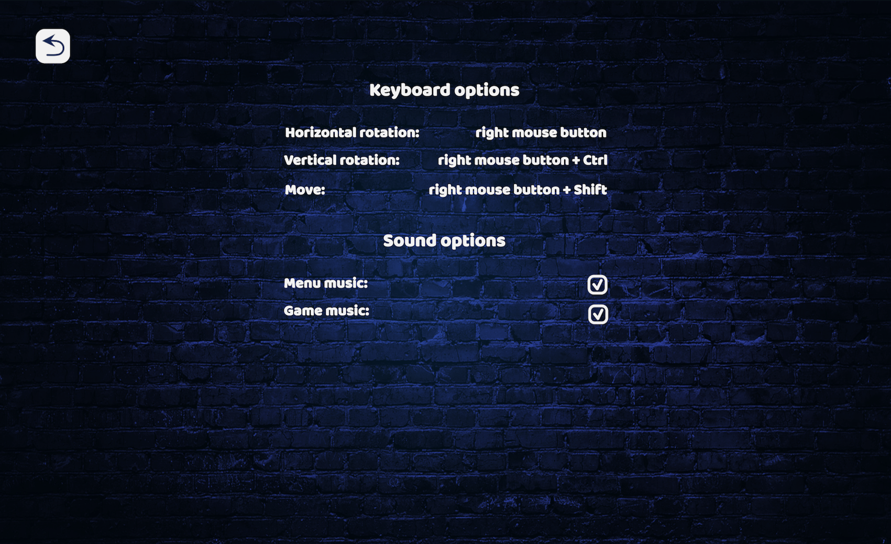

      

   

## About

"In The Shadows" is the [School 21](https://21-school.ru/) study project.   
This is a game close to "Shadowmatic". Players need to rotate objects for obtaining the right shapes from their shadows. The name of each level contains a clue about the shape you will obtain with the shadow.

## Documentation

The game contains:

- 4 levels with 3 difficulty levels:
    1. One object the player can apply horizontal rotations to.
    2. One object the player can apply horizontal and vertical rotations to.
    3. Many objects the player can apply horizontal and vertical rotations to and move around.
- 2 game modes:
  1. Normal mode takes the player on a path containing different puzzles.
  2. Test mode takes the player on a path where all the puzzles are unlocked.
- The possibility of controlling the game and the menu music (on the settings page)
- The possibility of a progress saving

### Game Control

Horizontal rotation - right mouse button   
Vertical rotation - right mouse button + Left Ctrl   
Moving - right mouse button + Left Shift

## Screenshots
<table>
    <tr>
            
    </tr>
    <tr>
            
    </tr>
    <tr>
            
    </tr>
    <tr>
            
    </tr>
    <tr>
            
    </tr>
</table>

## Developers

- [Anastasiia Radaeva](https://github.com/AnastasiiaRadaeva)
